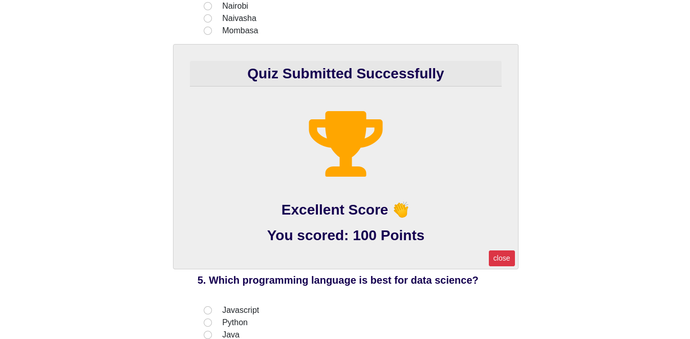

# Simple Quiz Game


## Project Description
This is a simple multi-choice quiz game made in **HTML 5**, **CSS**, **Bootstrap 5** and **Vanilla JavaScript**. Bootstrap is mainly used so as to reduce the size of the css file and also avoid writing too much media queries to make it responsive. The website of fully mobile responsive.

In this project, the HTML, CSS, and Bootsrap is used to create the UI whereas basic logic is done using Javascript.

The user fills in the form in the html file and Javascript listens for a submit event. 

Once the form is submitted, javascript cross-checks the provided choices with the real answers which are stored as an array. It the triggers a css class which then displays a popup showing the score and a custom message depending on the score resetting the form and the score at the same time.



## How to install and run

``` git clone https://github.com/Edu58/Quiz-Game.git ```


To run the project, copy the above git clone command and run it in your terminal, unzip the file if zipped, and open the **index.html** file in your browser.

You can also add, change, remove, increase, decrease the questions, scores or the answers according to your wish.
...
...
##### Author - Edu58
##### Contact - edumuriithi58@gmail.com
##### License - MIT